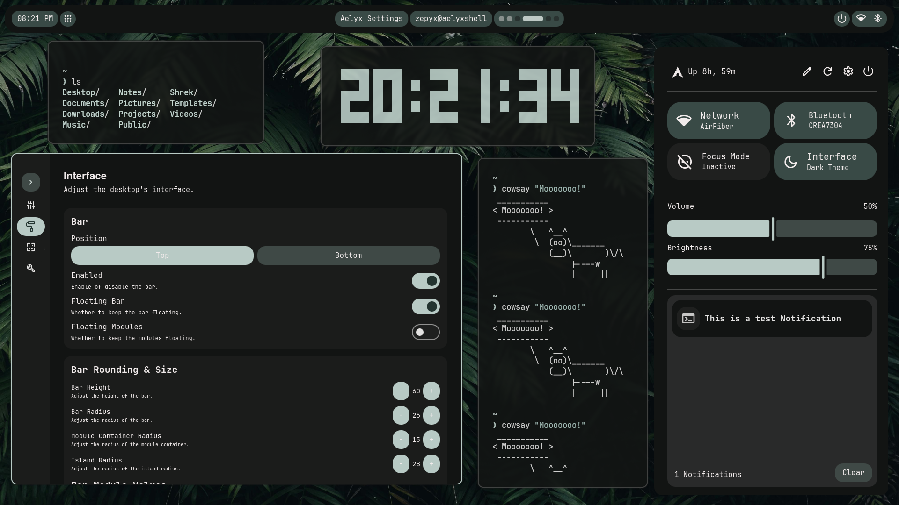
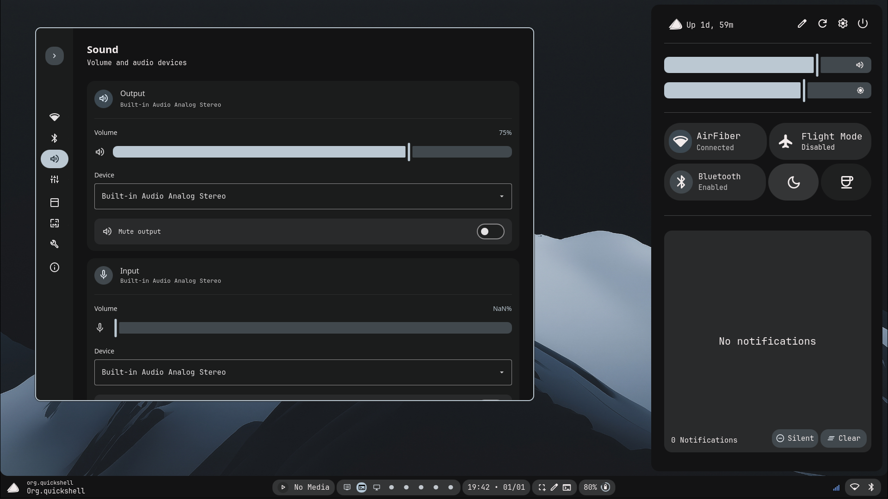
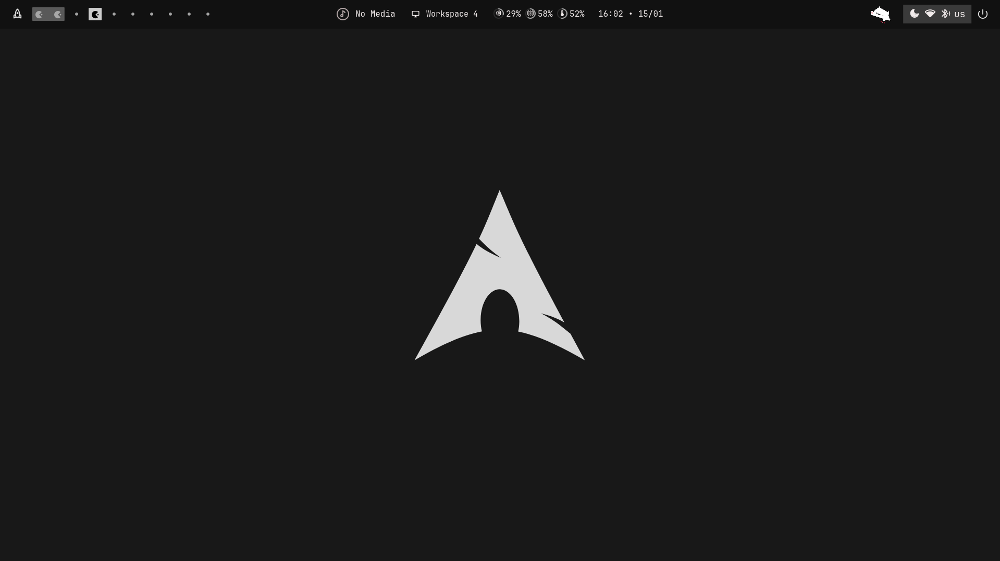

<h1 align="center">✦ Dotfiles ✦</h1>

    <i>These are my personal config files that I use.</i>

> [!IMPORTANT]
> If you only want the bar/sidebar/launcher or any widget visit [nucleus-shell](https://github.com/xZepyx/nucleus-shell).

## Screenshots!

